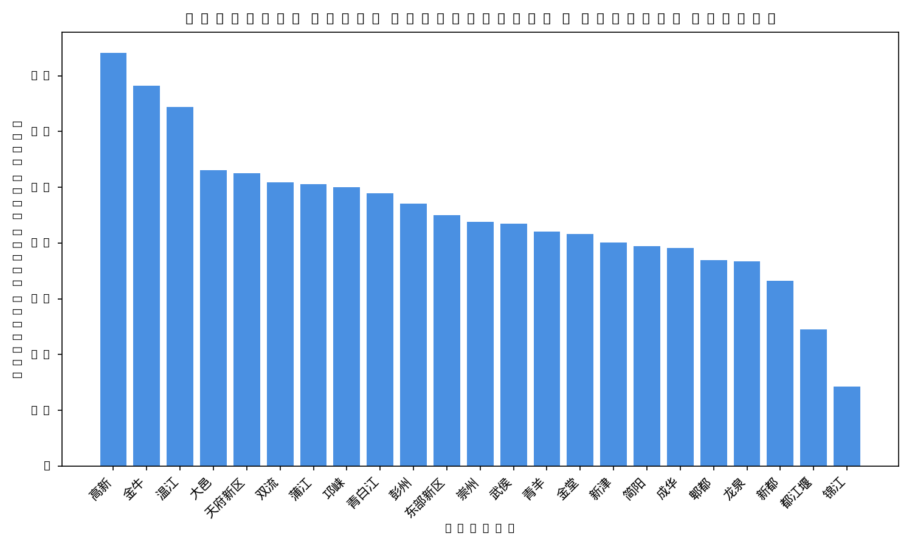
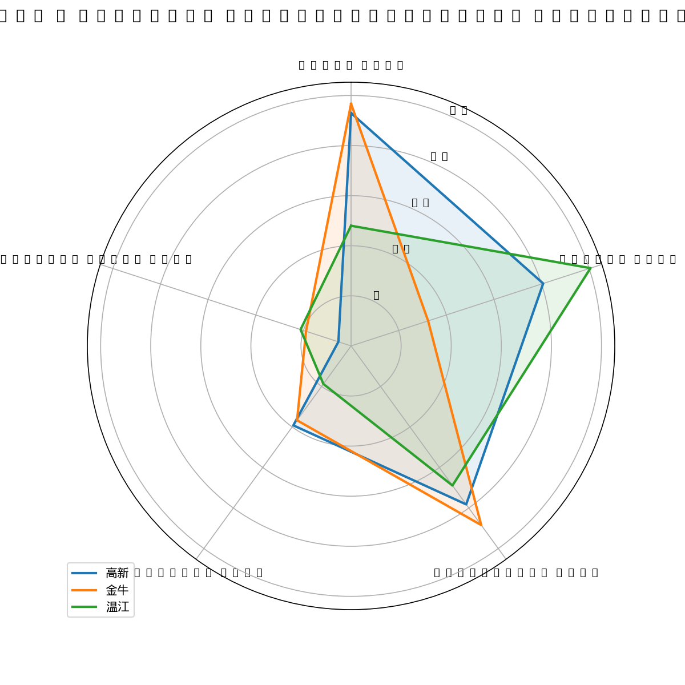

# Sales Performance Assessment Report

The evaluation system incorporates a 110-point mathematical calculation across 5 key dimensions:
**规模贡献 (Scale, 30%), 增长能力 (Growth, 30%), 销售效率 (Efficiency, 25%), 未来潜力 (Potential, 15%), and 重点业务 (Strategic Bonus, +10%)**.

## 1. Overall Comprehensive Rankings

This table demonstrates the overall assessment and ranks each region according to the comprehensive model.

| Rank | Region | Overall Score | Scale (30) | Growth (30) | Efficiency (25) | Potential (15) | Strategic Bonus (+10) |
|---|---|---|---|---|---|---|---|
| 1 | 高新 | **74.10** | 23.25 | 20.17 | 19.55 | 9.80 | 1.33 |
| 2 | 金牛 | **68.27** | 24.17 | 8.09 | 22.11 | 9.18 | 4.73 |
| 3 | 温江 | **64.36** | 12.00 | 25.14 | 17.22 | 4.70 | 5.30 |
| 4 | 大邑 | **53.03** | 7.23 | 24.85 | 12.06 | 2.83 | 6.05 |
| 5 | 天府新区 | **52.51** | 9.21 | 23.66 | 13.65 | 4.96 | 1.02 |
| 6 | 双流 | **50.85** | 16.06 | 1.75 | 16.05 | 15.00 | 2.00 |
| 7 | 蒲江 | **50.55** | 7.05 | 22.56 | 13.64 | 5.15 | 2.15 |
| 8 | 邛崃 | **49.99** | 7.27 | 20.63 | 15.76 | 2.68 | 3.65 |
| 9 | 青白江 | **48.90** | 6.49 | 19.27 | 19.30 | 3.35 | 0.49 |
| 10 | 彭州 | **47.07** | 5.79 | 17.82 | 13.76 | 3.85 | 5.84 |
| 11 | 东部新区 | **45.00** | 6.14 | 15.46 | 13.42 | 4.78 | 5.21 |
| 12 | 崇州 | **43.79** | 8.47 | 15.59 | 14.20 | 2.38 | 3.15 |
| 13 | 武侯 | **43.47** | 8.42 | 19.13 | 11.46 | 3.49 | 0.97 |
| 14 | 青羊 | **42.05** | 7.59 | 14.57 | 14.82 | 4.46 | 0.61 |
| 15 | 金堂 | **41.57** | 6.57 | 11.38 | 16.03 | 4.59 | 3.00 |
| 16 | 新津 | **40.07** | 7.72 | 15.16 | 13.24 | 3.75 | 0.20 |
| 17 | 简阳 | **39.41** | 8.96 | 13.17 | 14.06 | 3.17 | 0.05 |
| 18 | 成华 | **39.11** | 7.73 | 9.77 | 15.04 | 5.32 | 1.25 |
| 19 | 郫都 | **36.95** | 12.05 | 2.75 | 14.45 | 5.05 | 2.66 |
| 20 | 龙泉 | **36.67** | 6.96 | 10.27 | 14.59 | 4.28 | 0.57 |
| 21 | 新都 | **33.24** | 8.71 | 5.19 | 14.85 | 3.45 | 1.04 |
| 22 | 都江堰 | **24.47** | 2.49 | 8.01 | 11.89 | 1.55 | 0.53 |
| 23 | 锦江 | **14.24** | 5.81 | -8.70 | 12.75 | 4.33 | 0.05 |

> [!TIP]
> The **Top Performer** is **高新** with a leading overall score of **74.10**.

## 2. Overall Performance Distribution

## 3. Top 3 Regions Dimensional Breakdown

This multi-dimensional radar plot visualizes the competency models for the top 3 best-performing regions. A full outward graph reflects perfection across all normalized scale scoring structures. 

---
*Report automatically generated by Evaluation Service.*
